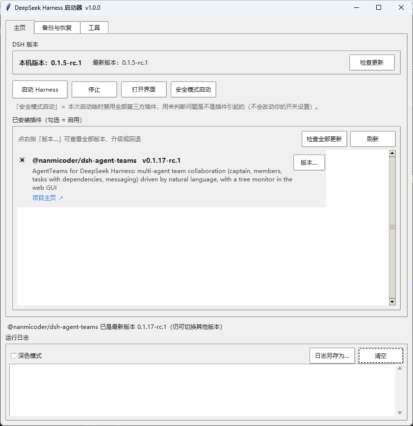
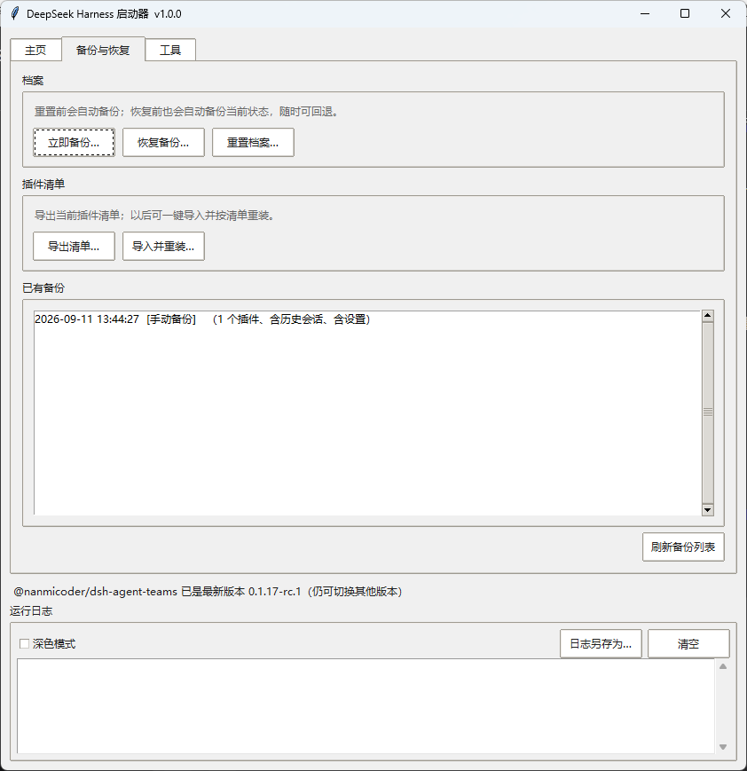
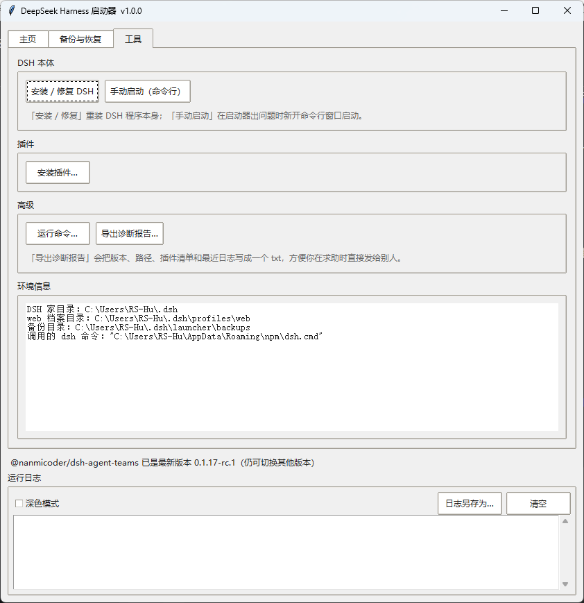
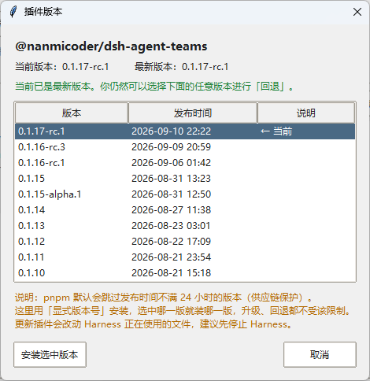

# DeepSeek Harness 启动器（图形界面）

一个用 Python + tkinter 写的 **DeepSeek Harness 启动器**，用于管理已安装的插件，
尤其是当某个插件导致 Harness 启动失败时，能帮你**不删任何数据**地把它关掉再重试。

## 下载

**不想装 Python？** 直接到 [Releases](../../releases) 页面下载 `DSH-Launcher.exe`，双击即可运行。

想用源码：克隆本仓库后双击 `启动器.bat`（或 `python launcher.py`）即可，无需安装任何第三方库。

## 界面预览

**主页** —— 版本检查、启动 / 停止、安全模式启动、插件开关与版本管理



| 备份与恢复 | 工具 |
|---|---|
|  |  |
| 备份 / 重置 / 还原，插件清单导入导出 | 安装修复、诊断报告、环境信息 |

**插件版本管理** —— 列出全部历史版本（含发布时间），既能升级、也能**回退**



## 它能做什么

- 显示本机 DeepSeek Harness 的**当前版本**和 npm 仓库里的**最新版本**，发现新版本时提示更新；
- 列出本机已安装的**全部插件**（名称、版本、简介、项目主页），每个插件带**开关**（勾选 = 启用）、
  **「版本…」**（列出全部可用版本含发布时间，**既能升级、也能回退**）
  和**「卸载…」**（**彻底删除**插件；删除前会自动备份一次档案，可回退）；
  顶部还有「检查全部更新」，一次检查所有插件；鼠标滚轮可直接滚动列表；
- **认得出「装了但不生效」的插件**：插件声明了插件层、却没被登记进档案时，会被单独列在
  红色分组「已安装但未挂载」里，并提供**一键「修复」**（放行被拦下的构建脚本 → 重新登记），
  不必自己开命令行折腾；
- **安装失败会说清原因**：不再只报一个退出码，而是识别出 pnpm 的
  `Ignored build scripts` 这类具体原因，并当场给出修复入口；
- **开关失灵会显性告警**：万一读不到插件条目（例如档案目录不可写），插件页顶部会明确写出
  「开关暂时不可用」和原因，而不是让开关静默失效；
- **装完提醒重启**：插件层发生变化后主动告诉你「需要重启才生效」，
  并可选**自动重启**（先停止、等端口释放、再启动）；
- 一键**启动** Harness 并实时显示日志，启动成功自动打开浏览器；
- **安全模式启动**：本次启动临时禁用**全部**第三方插件（**不改动**你的开关设置），
  一眼判断问题是不是插件引起的；
- **「上次正常配置」快照**：每次启动成功都会自动记下当时的插件配置；
  启动失败时错误弹窗里会出现「恢复上次正常配置」按钮，一键回退；
- **启动失败时**显示错误信息，并保留插件列表，你可以关闭可疑插件后再次启动；
- **导出诊断报告**：把版本、路径、插件清单和最近日志写成一个 txt，方便求助时直接发给别人；
- **关闭前提醒**：Harness 正在运行时关闭启动器会先确认，避免误关导致服务被停掉；
- **内置命令工具**：不用另开命令行，直接在启动器里就能
  「安装 / 修复 全局 DSH」「安装插件」「运行命令」，输出实时显示在日志面板；
- **备份与重置**：随时「手动备份」；「重置 web 档案」会**先自动备份再清空**（像游戏的自动存档）；
  恢复时可选择 **仅插件 / 仅历史会话 / 全部**，且恢复前还会再自动备份一次，可回退；
- **插件清单导入导出**：把插件清单导出为 JSON；以后一键导入重装，
  导入时会先逐個检查版本，告诉你哪些有新版本、让你决定装哪一版；
- **兜底手动启动**：万一启动器本身出问题，一键开命令行窗口，用最原始的方式启动 DSH；
- **界面记忆**：记住窗口大小 / 位置，可切换深色模式；日志可一键另存为 txt；
- 禁用是**可逆**的：随时可以再勾选回来，绝不会删掉你的插件或配置。

## 运行环境

- Windows
- Python 3.8 或更高版本（自带 tkinter，**无需安装任何第三方库**）
- 已安装 Node.js
- **已全局安装 DeepSeek Harness**（只需一次）：

```bat
npm install -g @deepseek-ai/dsh
```

> 为什么必须是全局安装？因为启动器通过全局 `dsh` 命令来查版本、启动、更新。
> 这样「更新」才是真正的更新（`npm install -g @deepseek-ai/dsh@latest`），
> 而不是像 `npx` 那样只更新一份藏在缓存里的副本。若没装，启动器会明确提示你。

## 使用方法

**最简单：双击 `启动器.bat`** 即可打开图形界面（不会弹出黑色命令行窗口）。

也可以手动在命令行执行（能看到报错信息，便于排查问题）：

```bat
python launcher.py
```

打开后点「启动 Harness」即可，启动成功后会自动打开浏览器。

界面分为三个选项卡（底部状态栏与运行日志始终可见）：

**① 主页** —— 日常最常用

| 控件 | 作用 |
|---|---|
| 本机 / 最新版本、检查更新 | 显示 DSH 版本并检查升级 |
| 启动 Harness / 停止 / 打开界面 | 启动、停止、重新打开浏览器 |
| **安全模式启动** | 本次启动临时禁用全部第三方插件（不改开关设置），用来定位问题 |
| 刷新 / 检查全部更新 | 重新读取插件；一次检查所有插件的新版本 |
| 每个插件右侧的「版本…」 | 查看全部可用版本（含发布时间），**升级或回退**到任意版本 |
| 每个插件右侧的「卸载…」 | **彻底删除**该插件（移除依赖与文件）；删除前会自动备份档案 |
| 未挂载插件右侧的「修复」 | 放行被 pnpm 拦下的构建脚本 → 重新登记插件层，让「装了但不生效」的插件真正生效 |

**② 备份与恢复**

| 按钮 | 作用 |
|---|---|
| 立即备份… | 创建一份备份（可选是否包含历史会话 / 插件文件） |
| 恢复备份… | 从备份还原，可选 **仅插件 / 仅历史会话 / 全部** |
| 重置档案… | **先自动备份**，再清空 `profiles/web`，让档案回到干净状态 |
| 导出清单… | 把插件清单（名称+版本）导出为 JSON |
| 导入并重装… | 读入清单 → 逐个检查版本 → 弹窗告诉你哪些有新版本 → 你勾选后一键装回 |
| 已有备份 | 列出所有备份，点「刷新备份列表」更新 |

**③ 工具**

| 按钮 | 作用 |
|---|---|
| 安装 / 修复 DSH | 执行 `npm install -g @deepseek-ai/dsh@latest`，首次安装或修复损坏的启动文件 |
| 手动启动（命令行） | 新开命令行窗口，用 `npx -y @deepseek-ai/dsh web` 最原始地启动 |
| 安装插件… | 输入包名后执行 `dsh plugin --profile web add <包名>`；失败时会分析原因，能识别出「构建脚本被拦下」并给出一键修复 |
| 运行命令… | 执行任意命令，输出实时显示在日志面板 |
| 导出诊断报告… | 把版本、路径、插件清单和最近日志写成一个 txt，方便求助时发给别人 |
| 环境信息 | 显示 DSH 家目录、档案目录、备份目录、实际调用的 dsh 命令（排查问题时有用） |

> 底部「运行日志」区域始终可见，右上角有「日志另存为…」和「清空」，
> 还有一个「深色模式」开关；窗口大小 / 位置会自动记住。

## 备份都包含什么？

一份备份放在 `~/.dsh/launcher/backups/<时间戳>/`，内容如下：

| 内容 | 说明 |
|---|---|
| `profile/` | 档案的配置类文件（`package.json`、`cordis.patch.yml`、锁文件等） |
| `plugins.json` | **已安装插件清单（名称 + 版本）**——插件靠它重装回来，不必复制庞大的文件 |
| `settings.yaml` | 全局设置（若存在） |
| `sessions/` | 历史会话（可选，体积可能较大） |
| `node_files/` | 插件文件本身（可选，很大很慢，一般不需要） |

> 数据是分开的，所以还原能选粒度：插件在 `~/.dsh/profiles/web`，
> 历史会话在 `~/.dsh/sessions`，两者互不影响。

## 为什么插件列表里要单独放「检查更新」按钮？

pnpm 11 默认开启了一道供应链保护 `minimumReleaseAge`（默认 **1440 分钟 = 1 天**）：
**发布时间不满 1 天的版本会被跳过**。后果很坑——如果你用 `add 包名@latest`，
pnpm 会静默地装一个"通过年龄检查的最新版"，而不是真正的最新版，
而且**退出码是 0、不报任何错**，看起来像成功了。

「检查更新」按钮的做法是：查出全部可用版本和发布时间 → 你选一个 →
用**显式版本号**安装（`add 包名@版本号`），从而不受这道限制。

## 为什么会有「已安装但未挂载」的插件？

pnpm 11 默认开启 `strictDepBuilds`（另一道供应链保护）：**默认不执行依赖包的安装脚本**。
如果某个插件带原生依赖（典型是 `node-pty`），安装命令会因为
`[ERR_PNPM_IGNORED_BUILDS] Ignored build scripts: ...` 而**以非 0 退出**，
并在档案目录的 `pnpm-workspace.yaml` 里写下 `allowBuilds: { 包名: "set this to true or false" }`
这样的占位值，等你来放行。

真正坑的地方在于 pnpm 与 dsh 的配合顺序：

| 环节 | 结果 |
|---|---|
| pnpm 把插件写进 `package.json` 的 `dependencies` | ✅ 已经写了（报错**之前**就写了） |
| pnpm 把文件放进 `node_modules` | ✅ 已经放了 |
| dsh 把插件登记进 `dsh.profile.bundles`（插件层） | ❌ **只在命令成功时才登记**，被跳过了 |

于是这个插件会停在「**文件都在、却从未被加载**」的半成品状态：
启动器列表里看得到它，但 Harness 完全不认它——**装了等于没装**。

启动器的处理是两步：

1. `pnpm approve-builds --all`（在档案目录）——把上面的占位值改成 `true`，放行构建脚本；
2. `dsh plugin --profile web add <包名>`——重跑一次安装，让 dsh 补上插件层登记。

做完要**重启 Harness**（插件层只在启动时加载）。这两步都只动档案目录，不会改 DSH 自己的配置。

## 工作原理（写给想了解的人）

- DeepSeek Harness 的用户数据都在 `~/.dsh`（或环境变量 `DSH_HOME` 指定的目录）下，
  web 界面对应其中的 `profiles/web` 档案。
- 你安装的插件记录在 `profiles/web/package.json` 的 `dependencies` 里，文件装在
  `profiles/web/node_modules/` 下。
- 「关闭插件」**不是**删文件，而是启动器在 `~/.dsh/launcher/disabled.patch.yml`
  里生成一个补丁，启动时用 `dsh web --patch <该文件>` 把它叠加上去。这样做：
  - 完全**不动** DSH 自己的 `cordis.patch.yml`，不会碰坏你的配置；
  - 随时可逆，且不会触发 DSH 的插件自动重装。
- 插件条目与「开关 id」的对应关系，来自 `dsh web --dump-config`（一个只打印配置、
  不真正启动服务的诊断命令），因此即使某个插件坏到让 Harness 起不来，通常仍能列出清单。

## 文件说明

| 文件 | 作用 |
|---|---|
| `launcher.py` | 图形界面入口（tkinter） |
| `core.py` | 与全局 `dsh` / `npm` 交互的底层封装 |
| `plugins.py` | 插件发现、元数据、开关状态 |
| `backup.py` | 备份 / 重置 / 还原、插件清单的导出导入 |
| `requirements.txt` | 依赖清单（本项目为空，无第三方依赖） |

## 打包成单个 exe（可选）

如果想让别人不用装 Python 也能用，可用 PyInstaller 打包：

```bat
pip install pyinstaller
pyinstaller -w -F -n DSH-Launcher launcher.py
```

生成的 `dist/DSH-Launcher.exe` 即可直接双击运行。

## 发布新版本（维护者）

本项目已配置 **GitHub Actions**：只要推送一个版本标签，云端就会**自动打包 exe 并创建 Release**。

1. 改完代码后，把 `launcher.py` 里的 `__version__` 改成新版本号（例如 `1.0.1`）；
2. 提交并推送：

```bat
git add .
git commit -m "修复：……"
git push
```

3. 打标签并推送（**这一步会触发自动发版**）：

```bat
git tag v1.0.1
git push origin v1.0.1
```

约 1 分钟后，到 [Actions](../../actions) 页面可以看到进度；完成后会自动生成新 Release 并附上 exe。

> 也可以在 Actions 页面点「构建并发布 Windows exe」→ **Run workflow**，手动填一个标签名来触发。

## 开源协议

本项目采用 [MIT 协议](LICENSE)，可自由使用、修改和分发（保留版权声明即可）。

## 致谢 / 免责

- 本项目是一个**第三方的社区工具**，与 DeepSeek 官方没有隶属关系。
- DeepSeek Harness 尚处预发布阶段（`0.x-rc`），其插件与配置格式可能随版本变化；
  本工具会尽量做防御式处理，遇到不兼容欢迎提 issue。
- 本工具只在你自己的机器上读写 `~/.dsh` 下的文件；所有改动（禁用插件、备份、重置）
  都是可逆的，且在覆盖前会先自动备份。
