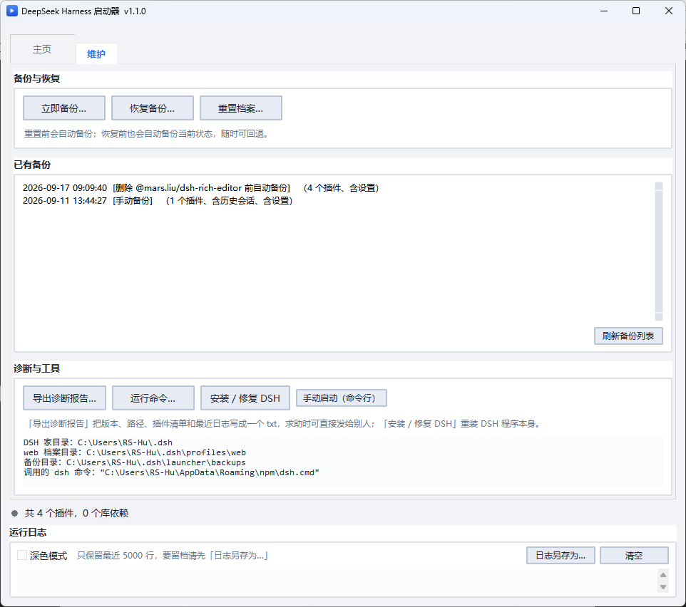
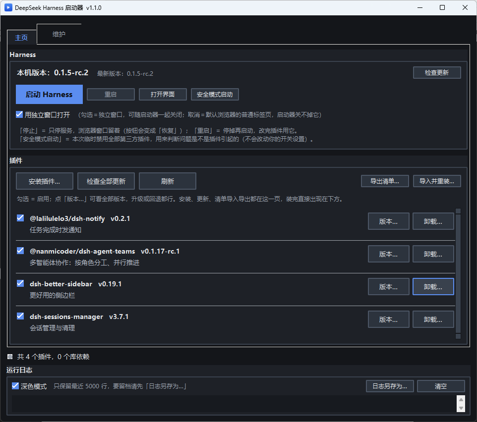
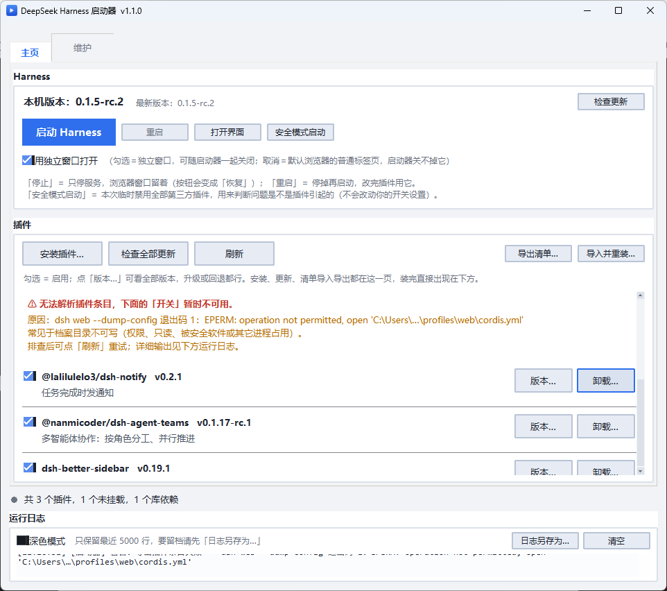

# DeepSeek Harness 启动器（图形界面）

一个用 Python + tkinter 写的 **DeepSeek Harness 启动器**，用于管理已安装的插件，
尤其是当某个插件导致 Harness 启动失败时，能帮你**不删任何数据**地把它关掉再重试。

## 下载

**不想装 Python？** 直接到 [Releases](../../releases) 页面下载 `DSH-Launcher.exe`，双击即可运行。

想用源码：克隆本仓库后双击 `启动器.bat`（或 `python launcher.py`）即可，无需安装任何第三方库。

## 界面预览

界面只有**两个选项卡**（常用操作都在主页），底部状态栏与运行日志始终可见：

**主页** —— 版本检查、启动 / 停止 / 重启、安全模式，以及**插件管理**（安装、更新、开关、卸载都在这一页）


| 维护 | 深色模式 |
|---|---|
|  |  |
| 备份 / 恢复 / 重置、诊断报告、环境信息、修复 DSH | 一键切换深浅色，全部控件统一样式 |

**诊断能力** —— 插件「装了但不生效」会被单独标出来并可一键修复；
读不到插件条目时也会显性告警（而不是让开关静默失灵）



## 它能做什么

- 显示本机 DeepSeek Harness 的**当前版本**和 npm 仓库里的**最新版本**，发现新版本时提示更新；
- 列出本机已安装的**全部插件**（名称、版本、简介、项目主页），每个插件带**开关**（勾选 = 启用）、
  **「版本…」**（列出全部可用版本含发布时间，**既能升级、也能回退**）
  和**「卸载…」**（**彻底删除**插件；删除前会自动备份一次档案，可回退）；
  顶部还有「检查全部更新」，一次检查所有插件；鼠标滚轮可直接滚动列表；
- **认得出「装了但不生效」的插件**：插件声明了插件层、却没被登记进档案时，会被单独列在
  红色分组「已安装但未挂载」里，并提供**一键「修复」**（放行被拦下的构建脚本 → 重新登记），
  不必自己开命令行折腾；
- **安装失败会说清原因**：不再只报一个退出码，而是识别出 pnpm 的
  `Ignored build scripts` 这类具体原因，并当场给出修复入口；
- **开关失灵会显性告警**：万一读不到插件条目（例如档案目录不可写），插件页顶部会明确写出
  「开关暂时不可用」和原因，而不是让开关静默失效；
- **装完提醒重启**：插件层发生变化后主动告诉你「需要重启才生效」，
  并可选**自动重启**（先停止、等端口释放、再启动）；
- 一键**启动** Harness 并实时显示日志，启动成功自动打开界面；主按钮是**三态**的：
  「启动」→「停止」→「恢复」——点「停止」**只停服务、浏览器窗口留着**，
  按钮变成「恢复」，适合临时停一下再拉起来；
- **等待有反馈（转圈）**：DSH 自身启动通常要几秒（node + 插件树，实测本机约 5~7 秒），
  这段等待启动器做不了别的 —— 但状态栏左侧的状态灯会**变成转圈的圆弧**，
  下面日志也在实时输出，不会让人以为点了没反应；
  启动结束（成功 / 失败 / 被停止）后自动变回实心圆点，动画自己停下；
- **点 X 立即退出**：关闭启动器时**不等** `taskkill` 把整棵进程树杀完
  （那一步会让界面白等几百毫秒到数秒；`taskkill` 是独立进程，启动器退出后它照样干完活）。
  点「停止」按钮时仍然会等 —— 否则紧接着点「重启」会撞上还没释放的端口；
- **「重启」按钮**：一步完成「关旧窗口 → 停服务 → 重新启动」，会先确认一次，避免误点打断对话。
  **按下就有反馈**：旧窗口立刻关掉、状态灯立刻开始转圈、状态栏写明「旧窗口已关闭，稍后会打开新窗口」
  —— 不会出现"卡住的旧窗口一直杵在那儿、也不知道在不在重启"的情况；
- **会告诉你"到底出了什么事"**：启动成功后，启动器在后台每 5 秒检查一次服务
  （不打扰操作；一切正常时不写日志、不动状态栏），能区分三种**现象很像、但处理办法完全不同**的情况：
  - **宿主进程已经退出** → 状态灯**变红**，状态栏写「服务已停（页面会一直显示「自动重连中」）」，
    主按钮回到「启动 Harness」，可直接拉起；
  - **宿主还在、但对请求没反应**（页面一直「自动重连中」、对话卡住；多半是机器繁忙，
    或本地回环流量被代理 / VPN 劫持）→ 状态灯**变橙**，日志里列出可能原因与处理顺序
    （先「打开界面」重开，仍不行再「重启」）；
  - **服务正常、只是独立窗口没了** → 提示点「打开界面」重开一个，**不必重启服务**；
  - 恢复正常时状态灯自动变回绿点，并记一行日志；
- **打开方式可以自己选**（主页「Harness」卡片里的勾选框，选择会被记住）：
  - **独立窗口**（默认）：用 Chrome / Edge 的**应用窗口**打开 —— 没有地址栏、像个 App，
    **出现后会自动最大化**（还原用窗口右上角按钮）。它由启动器持有，所以**关闭启动器时会
    一并把窗口关掉**（关闭前会明确列出将做什么）。
    代价是用独立配置（没有你平时的扩展 / 书签 / 登录态）；DSH 靠地址里的令牌认证，不影响使用。
    这种方式也最方便在「浏览器」和「独立窗口」之间来回切换着用。
  - **默认浏览器标签页**：和你平时上网完全一致（有扩展、有登录态），
    但浏览器不允许外部程序关掉任意标签页，所以**这种方式的页面启动器关不掉** ——
    关闭启动器时它会留在那儿（日志里会说明这一点）。
- **专属图标**：窗口、任务栏和 exe 文件都用启动器自己的图标，不再是 Python 默认图标；
- **统一的界面外观**：整个界面一份调色板管到底（窗口底 / 卡片 / 输入面三档灰度 + 一个强调色），
  ttk 与原生控件全都显式配过色，不会出现「灰一块白一块」；深浅色一键切换，两边都是同一套排版；
- **安全模式启动**：本次启动临时禁用**全部**第三方插件（**不改动**你的开关设置），
  一眼判断问题是不是插件引起的；
- **「上次正常配置」快照**：每次启动成功都会自动记下当时的插件配置；
  启动失败时错误弹窗里会出现「恢复上次正常配置」按钮，一键回退；
- **启动失败时说清原因**：除了原样给出日志，还会**认出已知的启动故障**并翻译成人话——
  例如「插件树加载失败：模块版本对不上」（某个插件把 DSH 自己的内部包 `@deepseek-ai/*`
  装进了档案，版本和全局那份冲突），会直接告诉你处理顺序，并给出一键「安装 / 修复 DSH…」；
  同时保留插件列表，你可以关闭可疑插件后再次启动；
- **导出诊断报告**：把版本、路径、插件清单和最近日志写成一个 txt，方便求助时直接发给别人；
- **内置命令工具**：不用另开命令行，直接在启动器里就能
  「安装 / 修复 全局 DSH」「安装插件」「运行命令」，输出实时显示在日志面板；
- **备份与重置**：随时「手动备份」；「重置 web 档案」会**先自动备份再清空**（像游戏的自动存档）；
  恢复时可选择 **仅插件 / 仅历史会话 / 全部**，且恢复前还会再自动备份一次，可回退；
- **插件清单导入导出**：把插件清单导出为 JSON；以后一键导入重装，
  导入时会先逐個检查版本，告诉你哪些有新版本、让你决定装哪一版；
- **兜底手动启动**：万一启动器本身出问题，一键开命令行窗口，用最原始的方式启动 DSH；
- **界面记忆**：记住窗口大小 / 位置，可切换深色模式；日志可一键另存为 txt；
- **日志带时间戳**：每一行前面都有 `[时:分:秒]`，事后排查故障不用靠内容猜顺序；
- **日志面板有上限**：只保留最近 5000 行（超出后自动丢弃最旧的），长时间开着也不会无限吃内存；
  面板标题旁会写明这一点，所以真要留档请在丢弃前用「日志另存为…」导出；
- 禁用是**可逆**的：随时可以再勾选回来，绝不会删掉你的插件或配置。

## 运行环境

- Windows
- Python 3.8 或更高版本（自带 tkinter，**无需安装任何第三方库**）
- 已安装 Node.js
- **已全局安装 DeepSeek Harness**（只需一次）：

```bat
npm install -g @deepseek-ai/dsh
```

> 为什么必须是全局安装？因为启动器通过全局 `dsh` 命令来查版本、启动、更新。
> 这样「更新」才是真正的更新（`npm install -g @deepseek-ai/dsh@latest`），
> 而不是像 `npx` 那样只更新一份藏在缓存里的副本。若没装，启动器会明确提示你。

## 使用方法

**最简单：双击 `启动器.bat`** 即可打开图形界面（不会弹出黑色命令行窗口）。

也可以手动在命令行执行（能看到报错信息，便于排查问题）：

```bat
python launcher.py
```

打开后点「启动 Harness」即可，启动成功后会自动打开界面。

界面只有**两个选项卡**（底部状态栏与运行日志始终可见）：

**① 主页** —— 日常最常用：Harness 状态 + 启动控制 + 插件管理

| 控件 | 作用 |
|---|---|
| 本机 / 最新版本、检查更新 | 显示 DSH 版本并检查升级 |
| 主按钮（**启动 Harness / 停止 / 恢复**） | 三态：启动服务 → 停止（**只停服务，浏览器窗口留着**，按钮变「恢复」）→ 恢复 |
| **重启** | 停掉再启动一步完成（改完插件用它），会先确认一次 |
| 打开界面 | 按当前选择的方式打开（或唤起）页面 |
| **用独立窗口打开**（勾选框） | 勾选＝Chrome/Edge 应用窗口，可随启动器关闭；取消＝默认浏览器标签页（启动器关不掉）。选择会被记住 |
| **安全模式启动** | 本次启动临时禁用全部第三方插件（不改开关设置），用来定位问题 |
| 安装插件… | 输入包名后执行 `dsh plugin --profile web add <包名>`；失败时分析原因，能识别「构建脚本被拦下」并给出一键修复 |
| 检查全部更新 / 刷新 | 一次检查所有插件的新版本；重新读取插件列表 |
| 导出清单… / 导入并重装… | 导出插件清单为 JSON；导入时逐个检查版本，你勾选后一键装回 |
| 每个插件右侧的「版本…」 | 查看全部可用版本（含发布时间），**升级或回退**到任意版本 |
| 每个插件右侧的「卸载…」 | **彻底删除**该插件（移除依赖与文件）；删除前会自动备份档案 |
| 未挂载插件右侧的「修复」 | 放行被 pnpm 拦下的构建脚本 → 重新登记插件层，让「装了但不生效」的插件真正生效 |

**② 维护** —— 需要时才用

| 按钮 | 作用 |
|---|---|
| 立即备份… | 创建一份备份（可选是否包含历史会话 / 插件文件） |
| 恢复备份… | 从备份还原，可选 **仅插件 / 仅历史会话 / 全部** |
| 重置档案… | **先自动备份**，再清空 `profiles/web`，让档案回到干净状态 |
| 已有备份 | 列出所有备份，点「刷新备份列表」更新 |
| 导出诊断报告… | 把版本、路径、插件清单和最近日志写成一个 txt，方便求助时发给别人 |
| 运行命令… | 执行任意命令，输出实时显示在日志面板 |
| 安装 / 修复 DSH | 执行 `npm install -g @deepseek-ai/dsh@latest`，首次安装或修复损坏的启动文件 |
| 手动启动（命令行） | 新开命令行窗口，用最原始的方式启动 DSH（启动器本身出问题时的兜底） |
| 环境信息 | 显示 DSH 家目录、档案目录、备份目录、实际调用的 dsh 命令（排查问题时有用） |

> 底部「运行日志」区域始终可见，右上角有「日志另存为…」和「清空」，
> 还有一个「深色模式」开关；窗口大小 / 位置会自动记住。
> 每行前面都带 `[时:分:秒]` 时间戳；面板只保留最近 5000 行（超出后从顶部丢弃最旧的），
> 避免长跑时无限占内存——需要留档请先用「日志另存为…」导出。

## 备份都包含什么？

一份备份放在 `~/.dsh/launcher/backups/<时间戳>/`，内容如下：

| 内容 | 说明 |
|---|---|
| `profile/` | 档案的配置类文件（`package.json`、`cordis.patch.yml`、锁文件等） |
| `plugins.json` | **已安装插件清单（名称 + 版本）**——插件靠它重装回来，不必复制庞大的文件 |
| `settings.yaml` | 全局设置（若存在） |
| `sessions/` | 历史会话（可选，体积可能较大） |
| `node_files/` | 插件文件本身（可选，很大很慢，一般不需要） |

> 数据是分开的，所以还原能选粒度：插件在 `~/.dsh/profiles/web`，
> 历史会话在 `~/.dsh/sessions`，两者互不影响。

## 为什么插件列表里要单独放「检查更新」按钮？

pnpm 11 默认开启了一道供应链保护 `minimumReleaseAge`（默认 **1440 分钟 = 1 天**）：
**发布时间不满 1 天的版本会被跳过**。后果很坑——如果你用 `add 包名@latest`，
pnpm 会静默地装一个"通过年龄检查的最新版"，而不是真正的最新版，
而且**退出码是 0、不报任何错**，看起来像成功了。

「检查更新」按钮的做法是：查出全部可用版本和发布时间 → 你选一个 →
用**显式版本号**安装（`add 包名@版本号`），从而不受这道限制。

## 为什么会有「已安装但未挂载」的插件？

pnpm 11 默认开启 `strictDepBuilds`（另一道供应链保护）：**默认不执行依赖包的安装脚本**。
如果某个插件带原生依赖（典型是 `node-pty`），安装命令会因为
`[ERR_PNPM_IGNORED_BUILDS] Ignored build scripts: ...` 而**以非 0 退出**，
并在档案目录的 `pnpm-workspace.yaml` 里写下 `allowBuilds: { 包名: "set this to true or false" }`
这样的占位值，等你来放行。

真正坑的地方在于 pnpm 与 dsh 的配合顺序：

| 环节 | 结果 |
|---|---|
| pnpm 把插件写进 `package.json` 的 `dependencies` | ✅ 已经写了（报错**之前**就写了） |
| pnpm 把文件放进 `node_modules` | ✅ 已经放了 |
| dsh 把插件登记进 `dsh.profile.bundles`（插件层） | ❌ **只在命令成功时才登记**，被跳过了 |

于是这个插件会停在「**文件都在、却从未被加载**」的半成品状态：
启动器列表里看得到它，但 Harness 完全不认它——**装了等于没装**。

启动器的处理是两步：

1. `pnpm approve-builds --all`（在档案目录）——把上面的占位值改成 `true`，放行构建脚本；
2. `dsh plugin --profile web add <包名>`——重跑一次安装，让 dsh 补上插件层登记。

做完要**重启 Harness**（插件层只在启动时加载）。这两步都只动档案目录，不会改 DSH 自己的配置。

## 工作原理（写给想了解的人）

- DeepSeek Harness 的用户数据都在 `~/.dsh`（或环境变量 `DSH_HOME` 指定的目录）下，
  web 界面对应其中的 `profiles/web` 档案。
- 你安装的插件记录在 `profiles/web/package.json` 的 `dependencies` 里，文件装在
  `profiles/web/node_modules/` 下。
- 「关闭插件」**不是**删文件，而是启动器在 `~/.dsh/launcher/disabled.patch.yml`
  里生成一个补丁，启动时用 `dsh web --patch <该文件>` 把它叠加上去。这样做：
  - 完全**不动** DSH 自己的 `cordis.patch.yml`，不会碰坏你的配置；
  - 随时可逆，且不会触发 DSH 的插件自动重装。
- 插件条目与「开关 id」的对应关系，来自 `dsh web --dump-config`（一个只打印配置、
  不真正启动服务的诊断命令），因此即使某个插件坏到让 Harness 起不来，通常仍能列出清单。
- **什么时候能关掉浏览器窗口**：勾了「用独立窗口打开」时，界面是用 Chrome / Edge 的
  **应用窗口**模式打开的（`--app=` + 一个独立的 `--user-data-dir`）。独立配置目录会强制
  浏览器**为它另起一个浏览器进程**，于是那个进程的命令行里带着我们的目录名，启动器就能
  靠它精确地关掉 —— 而且**只认浏览器进程的映像名**（node / powershell / cmd 一律不碰），
  所以绝不会误伤别的程序。（早先一版只按命令行文本匹配、不限映像名，结果把 DSH 自己的
  子进程 runner 当成浏览器杀掉，把宿主搞崩过一次；现在代码里和测试里都锁死了这条规则。）
  没勾选时走默认浏览器的普通标签页，这种页面**关不掉**，日志会说明。
- **应用窗口为什么能自动最大化**：实测 `--start-maximized` 对**普通窗口**有效，
  但对 **`--app` 应用窗口会被浏览器忽略**（我第一版就栽在这里，还误以为验证过了）。
  现在改成：窗口出现后由启动器用 Win32 `ShowWindow(SW_MAXIMIZE)` 自己最大化 ——
  窗口按「我们 Popen 起来的那个进程的 PID」精确定位，不会动到用户自己的浏览器窗口；
  这一步放在后台线程里做，不阻塞界面，结果（成功 / 失败原因）写进日志。
- **健康检查是怎么做的**：每 5 秒用一次 GET 探一下那个带 token 的本地地址，
  外加看一眼自己启动的宿主进程还在不在。两个细节值得记一下：
  ① 探测时**显式清空了代理**（Python 在 Windows 上默认会读系统代理，用户开着 Clash 时
  连 `127.0.0.1` 都会被送去代理，检查必然误报）；
  ② **只要服务器回了任何状态码就算"活着"** —— 只有连接失败 / 超时才算"无响应"，
  那正是用户看到的"页面一直自动重连中"。
  启动器看不到页面的 WebSocket（那是浏览器和宿主之间的事），但这三条信息足够把
  "服务挂了 / 服务卡住了 / 只是页面或窗口掉了"分开，并告诉用户该按哪个按钮。
- **为什么启动时不会冒出控制台窗口**：启动器是 `pythonw` 起的 —— 它**没有控制台**。
  从这种进程启动 node / npm / pnpm / taskkill 这类**控制台程序**时，Windows 会替子进程
  **分配一个新控制台**；而 Windows 11 的默认终端是 Windows Terminal，于是屏幕上就会
  **弹出一个终端窗口**（标题是 `…\node.EXE`）—— 看起来就像"一启动就多了个 cmd 窗口"。
  所以启动器给所有子进程都加了 `CREATE_NO_WINDOW`（见 `core.no_window_flags()`）：
  进程照常有控制台、输出照常走管道，只是**不给它窗口**。
  「手动启动（命令行）」是唯一的例外 —— 那个本来就要开窗口。
- **深色 / 浅色为什么不会再「灰一块白一块」**：颜色由 `theme.py` 一处集中管理，
  ttk 里用到的每个样式类都显式配过，tk 原生控件（Text / Listbox / Canvas）另外逐个上色，
  层次靠 1px 边框与留白而不是靠色块对比。勾选框的「勾」也是自己画的 ——
  clam 主题自带的那张「已选中」其实是个 ✕，容易被读成「没勾上」。

## 文件说明

| 文件 | 作用 |
|---|---|
| `launcher.py` | 图形界面入口（tkinter） |
| `theme.py` | 统一外观：调色板 + 全部 ttk / 原生控件样式（深浅色各一套） |
| `browser.py` | 用「应用窗口」方式打开界面，并让启动器管得住它（可随启动器一起关闭） |
| `core.py` | 与全局 `dsh` / `npm` 交互的底层封装 |
| `plugins.py` | 插件发现、元数据、开关状态、安装失败诊断 |
| `backup.py` | 备份 / 重置 / 还原、插件清单的导出导入 |
| `assets/launcher.ico` | 程序图标（窗口、任务栏、exe 共用） |
| `tools/make_icon.py` | 图标生成脚本（纯标准库，可重复运行） |
| `tools/make_screenshots.py` | README 截图生成脚本（只截启动器自己的窗口） |
| `requirements.txt` | 依赖清单（本项目为空，无第三方依赖） |

## 打包成单个 exe（可选）

如果想让别人不用装 Python 也能用，可用 PyInstaller 打包：

```bat
pip install pyinstaller
pyinstaller -w -F -n DSH-Launcher --icon assets/launcher.ico --add-data "assets;assets" launcher.py
```

生成的 `dist/DSH-Launcher.exe` 即可直接双击运行。

> `--icon` 决定 exe 文件自身的图标；`--add-data` 把 `assets` 打进包里，
> 运行时的**窗口 / 任务栏图标**靠它（代码里用 `sys._MEIPASS` 定位）。
> 两者都要写，只写 `--icon` 的话窗口图标会回退成默认图标。

## 发布新版本（维护者）

本项目已配置 **GitHub Actions**：只要推送一个版本标签，云端就会**自动打包 exe 并创建 Release**。

1. 改完代码后，把 `launcher.py` 里的 `__version__` 改成新版本号（例如 `1.0.1`）；
2. 提交并推送：

```bat
git add .
git commit -m "修复：……"
git push
```

3. 打标签并推送（**这一步会触发自动发版**）：

```bat
git tag v1.0.1
git push origin v1.0.1
```

约 1 分钟后，到 [Actions](../../actions) 页面可以看到进度；完成后会自动生成新 Release 并附上 exe。

> 也可以在 Actions 页面点「构建并发布 Windows exe」→ **Run workflow**，手动填一个标签名来触发。

## 开源协议

本项目采用 [MIT 协议](LICENSE)，可自由使用、修改和分发（保留版权声明即可）。

## 致谢 / 免责

- 本项目是一个**第三方的社区工具**，与 DeepSeek 官方没有隶属关系。
- DeepSeek Harness 尚处预发布阶段（`0.x-rc`），其插件与配置格式可能随版本变化；
  本工具会尽量做防御式处理，遇到不兼容欢迎提 issue。
- 本工具只在你自己的机器上读写 `~/.dsh` 下的文件；所有改动（禁用插件、备份、重置）
  都是可逆的，且在覆盖前会先自动备份。
